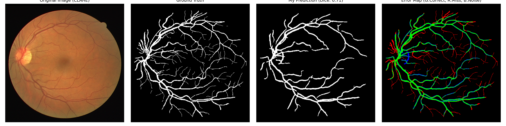

# Retinal Vessel Segmentation based on Optimized U-Net

## 1. Project Overview
This project implements a retinal vessel segmentation pipeline on the **DRIVE dataset** using an improved **U-Net** architecture. 

Despite the limited training data (20 images) and severe class imbalance, this project achieves a **Dice Score of 0.7148** and significant visual improvements through the following key optimizations:
- **Preprocessing**: CLAHE (Contrast Limited Adaptive Histogram Equalization).
- **Loss Function**: Hybrid Loss (BCE + Dice Loss).
- **Training Strategy**: Data Augmentation (Rotation/Flipping) & Class Weighting.
- **Post-processing**: Morphological optimization and Threshold searching.

## 2. Methodology & Improvements

### 2.1 Preprocessing: CLAHE
The contrast of original retinal images is often insufficient. I implemented **CLAHE** on the L-channel (LAB color space) to enhance vessel details without distorting color information.

### 2.2 Hybrid Loss Function
To address the severe class imbalance (Vessel:Background $\approx$ 1:9), I replaced the standard BCE Loss with a hybrid approach:
$$ Loss = 0.2 \times BCEWithLogitsLoss(pos\_weight=9.0) + 0.8 \times DiceLoss $$

### 2.3 Post-processing
An automated evaluation script was developed to search for the optimal threshold (0.3) and remove small isolated noise using morphological operations (`skimage.morphology.remove_small_objects`).

## 3. Results & Ablation Study

### Visual Comparison

*(Original Image; Ground Truth; Segmentation Result; Error Map)*

### Ablation Study (Experimental Log)
The following table demonstrates the step-by-step optimization process:

| Exp ID | Strategy | Key Modification | Train Loss | Dice Score | Observation |
| :--- | :--- | :--- | :--- | :--- | :--- |
| **Baseline** | U-Net (Initial) | `--classes 1` | 0.808 | N/A | Prediction was all black (Normalization issue). |
| **Exp 1** | + Normalization | Mask `/ 255.0` | 0.615 | < 0.50 | Still black; model biased towards background. |
| **Exp 2** | + Class Weight | `pos_weight=5.0` | 0.632 | ~0.50 | Vessels appeared but were fragmented. |
| **Exp 3** | + CLAHE | L-channel Enhancement | 0.631 | ~0.55 | Optic disc clearer; tiny vessels missed. |
| **Exp 4** | + Dice Loss | `0.5*BCE + 0.5*Dice` | 0.307 | ~0.60 | **Major Breakthrough**: Main vessels connected. |
| **Exp 5** | + Augmentation | Random Rotation | 0.341 | 0.657 | Better sensitivity, but high False Positive. |
| **Final** | **+ Post-Process** | `Threshold=0.3` + Clean | **N/A** | **0.715** | **Clean background, High Precision.** |

### Final Metrics
- **Dice Score (F1)**: 0.7148
- **Precision**: 0.7849
- **Recall**: 0.6677

## 4. Quick Start

### Prerequisites
```bash
pip install -r requirements.txt
```

### Training
```bash
python train.py --epochs 50 --batch-size 4 --learning-rate 1e-4 --classes 1
```

### Inference / Testing
```bash
python predict.py -i data/test_imgs/01_test.png -o result.png
# Or run the evaluation script for metrics
python evaluate_model.py
```